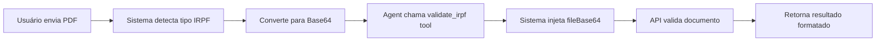
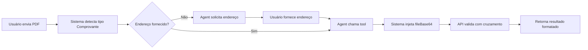

# 🤖 Chat Agent para Validação de Documentos

Sistema de chat inteligente especializado em validação de documentos de IRPF e Comprovantes de Residência, desenvolvido com Next.js, LangGraph e Google Gemini.

## 🎯 Objetivo

Este projeto implementa um agente conversacional que:

- Mantém conversação natural em português com tom formal e educado
- Valida documentos de **IRPF** (Imposto de Renda Pessoa Física)
- Valida **Comprovantes de Residência** com verificação de endereço
- Utiliza tool calling para chamadas automatizadas de APIs de validação
- Mantém contexto da conversa e gerencia estado de arquivos enviados

## 🚀 Tecnologias

- **Next.js 15.0.5** - Framework React com App Router
- **React 19** - Biblioteca de interface do usuário
- **TypeScript 5** - Linguagem de programação tipada
- **LangGraph 1.0.2** - Orquestração de agentes conversacionais com grafo de estados
- **LangChain 1.1.1** - Framework para aplicações com LLMs
- **Google Gemini 2.5 Flash** - Modelo de linguagem com suporte a tools
- **Tailwind CSS 4** - Framework de estilização
- **Zod 4.1.13** - Validação de schemas TypeScript
- **React Markdown** - Renderização de Markdown nas respostas

## ✨ Funcionalidades

### Interface e UX

- ✅ Interface de chat moderna e responsiva
- ✅ Upload de arquivos PDF via drag-and-drop ou botão de anexo
- ✅ Preview de arquivos anexados antes do envio
- ✅ Renderização de Markdown nas respostas (negrito, listas, emojis, código)
- ✅ Scroll automático para novas mensagens
- ✅ Loading state durante processamento
- ✅ Mensagem de boas-vindas educativa

### Agente Conversacional

- ✅ Conversação natural em português com tom formal e educado
- ✅ Guardrails rigorosos - foco exclusivo em validação de documentos
- ✅ Coleta inteligente de informações (ex: solicita endereço quando necessário)
- ✅ Gerenciamento de contexto e histórico da conversa
- ✅ Injeção automática de arquivos base64 nas tools
- ✅ Tratamento de erros com mensagens amigáveis

### Validações

- ✅ **IRPF**: Validação automática ao receber PDF
- ✅ **Comprovante de Residência**: Validação com cruzamento de dados de endereço
- ✅ Tool calling integrado com LangGraph
- ✅ Feedback detalhado dos resultados de validação

## 🔧 Instalação e Configuração

### Pré-requisitos

- Node.js >= 20.9.0 (recomendado)
- npm ou yarn

### Passos de Instalação

1. **Clone o repositório** (se aplicável):

```bash
git clone <repository-url>
cd document-chat-agent
```

2. **Instale as dependências**:

```bash
npm install
```

3. **Configure as variáveis de ambiente**:

Crie um arquivo `.env.local` na raiz do projeto:

```bash
touch .env.local
```

4. **Adicione sua chave da API do Google Gemini**:

```env
GOOGLE_API_KEY=sua_chave_aqui
```

> 🔑 **Obtenha sua chave em**: [Google AI Studio](https://aistudio.google.com/app/apikey)

5. **Verifique as configurações** (opcional):
   - As chaves de API de validação estão configuradas em `lib/tools.ts`
   - O modelo Gemini está configurado em `lib/graph.ts` (atualmente usando `gemini-2.5-flash`)

## 🎮 Como Usar

### Iniciando o Servidor

```bash
npm run dev
```

Acesse: **[http://localhost:3000](http://localhost:3000)**

### Interagindo com o Agente

1. **Inicie a conversa**

   - O agente apresentará as opções de validação disponíveis
   - Informe qual tipo de documento deseja validar

2. **Envie seu documento**

   - Clique no botão 📎 para anexar um arquivo PDF
   - Ou use drag-and-drop (se disponível)
   - O arquivo será exibido como preview antes do envio

3. **Para IRPF**:

   - Simplesmente envie o PDF
   - O agente processará automaticamente
   - Aguarde o resultado da validação

4. **Para Comprovante de Residência**:
   - Envie o PDF do comprovante
   - O agente solicitará o endereço completo
   - Forneça no formato: `Rua, Número, Bairro, Cidade, Estado - CEP`
   - Aguarde a validação cruzada dos dados

### Dicas de Uso

- ✅ Use apenas arquivos PDF
- ✅ O agente responde apenas sobre validação de documentos
- ✅ Perguntas fora do escopo recebem redirecionamento educado
- ✅ Você pode fazer perguntas sobre o processo a qualquer momento

## 📝 Fluxo de Validação

### IRPF (Imposto de Renda Pessoa Física)



**Passos**:

1. Usuário anexa e envia documento PDF do IRPF
2. Sistema converte arquivo para Base64 e armazena no estado
3. Agent identifica a intenção e chama a tool `validate_irpf`
4. Sistema injeta automaticamente o `fileBase64` nos parâmetros da tool
5. Tool faz requisição POST para API de validação
6. Resultado é parseado e formatado em Markdown
7. Usuário recebe feedback detalhado

### Comprovante de Residência



**Passos**:

1. Usuário anexa e envia documento PDF do comprovante
2. Sistema converte arquivo para Base64
3. Agent verifica se endereço foi fornecido
4. Se não: Agent solicita endereço completo no formato especificado
5. Agent chama a tool `validate_proof_of_residence` com o endereço
6. Sistema injeta automaticamente o `fileBase64`
7. Tool faz requisição POST para API com documento e endereço
8. API realiza validação cruzada dos dados
9. Resultado é formatado e retornado ao usuário

## 🏗️ Arquitetura

### Estrutura do Projeto

```
document-chat-agent/
├── app/
│   ├── api/
│   │   └── chat/
│   │       └── route.ts         # API endpoint do chat (Next.js Route Handler)
│   ├── layout.tsx               # Layout raiz da aplicação
│   ├── page.tsx                 # Página principal com interface do chat
│   └── globals.css              # Estilos globais
├── lib/
│   ├── graph.ts                 # LangGraph workflow e orquestração
│   └── tools.ts                 # Tools de validação (LangChain tools)
├── public/                      # Arquivos estáticos
├── next.config.ts               # Configuração do Next.js
├── tailwind.config.ts           # Configuração do Tailwind
├── tsconfig.json                # Configuração do TypeScript
└── .env.local                   # Variáveis de ambiente (não versionado)
```

### Componentes Principais

#### 📄 `lib/graph.ts` - LangGraph Workflow

Define o grafo de estados conversacional:

- **StateAnnotation**: Define o estado com mensagens e fileStorage
- **callModel**: Node que invoca o Gemini com system prompt e tools
- **callTools**: Node que executa tools e injeta fileBase64 automaticamente
- **shouldContinue**: Função de decisão para routing condicional
- **workflow**: Grafo compilado com nodes e edges

**Fluxo do Grafo**:

```
__start__ → agent → [conditional]
                    ├─ tools → agent (loop)
                    └─ __end__
```

#### 🔧 `lib/tools.ts` - LangChain Tools

Implementa as ferramentas de validação:

- **validateIrpfTool**: Valida documentos IRPF via API
- **validateProofOfResidenceTool**: Valida comprovantes com endereço
- Schemas Zod para validação de parâmetros
- Conversão de Base64 para FormData
- Tratamento de erros e respostas padronizadas

#### 🌐 `app/api/chat/route.ts` - API Route Handler

- Recebe requisições POST com mensagens e arquivos
- Converte arquivos PDF para Base64
- Armazena arquivos no estado do grafo
- Executa o workflow do LangGraph
- Stream de respostas (preparado para SSE)
- Retorna mensagens formatadas

#### 🎨 `app/page.tsx` - Interface do Chat

- Componente React com hooks de estado
- Gerenciamento de mensagens e arquivos
- Upload de PDF com preview
- Renderização de Markdown com react-markdown
- Auto-scroll e loading states
- Validação de tipos de arquivo

### Fluxo de Dados

```
┌─────────────┐
│   Usuário   │
└──────┬──────┘
       │ (1) Envia mensagem + PDF
       ▼
┌─────────────────┐
│   page.tsx      │ ◄── Interface React
│   (Frontend)    │
└──────┬──────────┘
       │ (2) POST /api/chat
       ▼
┌─────────────────┐
│  route.ts       │ ◄── API Route Handler
│  (Backend)      │
└──────┬──────────┘
       │ (3) Executa graph
       ▼
┌─────────────────┐
│   graph.ts      │ ◄── LangGraph Orchestration
│  (Agent Logic)  │
└──────┬──────────┘
       │ (4) Chama tools
       ▼
┌─────────────────┐
│   tools.ts      │ ◄── LangChain Tools
│ (Validations)   │
└──────┬──────────┘
       │ (5) HTTP Request
       ▼
┌─────────────────┐
│  External APIs  │ ◄── Validation Services
│   (IRPF/PoR)    │
└─────────────────┘
```

### Padrões de Arquitetura

- **State Management**: LangGraph StateAnnotation com fileStorage
- **Tool Calling**: LangChain tools bindadas ao modelo Gemini
- **Type Safety**: TypeScript com Zod schemas
- **Error Handling**: Try-catch com mensagens JSON padronizadas
- **Separation of Concerns**: UI / API / Logic / Tools em camadas distintas

## 🔌 APIs Externas Utilizadas

### API de Validação de IRPF

**Endpoint**:

```
POST https://release-remessai-gateway.eurodolar.xyz/api/documents/process/irpf
```

**Headers**:

```
Authorization: cmfh5284v0002en3m1j3k7d3a
Content-Type: multipart/form-data
```

**Body (FormData)**:

- `irpf`: Arquivo PDF do documento IRPF

**Resposta Esperada**:

```json
{
  "success": true,
  "message": "IRPF validado com sucesso!",
  "data": { ... }
}
```

---

### API de Validação de Comprovante de Residência

**Endpoint**:

```
POST https://remessai-gateway.remessaonline.com.br/api/documents/process/proof-of-residence
```

**Headers**:

```
Authorization: cmebh72jq000kea3yet7qawle
Content-Type: multipart/form-data
```

**Body (FormData)**:

- `document`: Arquivo PDF do comprovante
- `currentAddress[value]`: String com endereço completo

**Formato do Endereço**:

```
Rua, Número, Bairro, Cidade, Estado - CEP
```

**Resposta Esperada**:

```json
{
  "success": true,
  "message": "Comprovante de residência validado com sucesso!",
  "data": { ... }
}
```

> ⚠️ **Nota de Segurança**: As chaves de autorização estão hardcoded em `lib/tools.ts`. Em produção, considere movê-las para variáveis de ambiente.

## 🤖 Estratégia de Tool Calling e LangGraph

### Como Funciona o Tool Calling

O sistema utiliza o recurso de **function calling** do Google Gemini integrado ao LangGraph:

1. **Binding de Tools**: As tools são "bindadas" ao modelo usando `.bindTools(tools)`
2. **Decisão Automática**: O modelo decide autonomamente quando chamar cada tool baseado no contexto
3. **Injeção de Parâmetros**: O sistema injeta automaticamente o `fileBase64` das tools
4. **Execução**: Tools retornam JSON estruturado que o modelo interpreta
5. **Loop Conversacional**: O grafo permite múltiplas interações tool → model até completar a tarefa

### System Prompt e Guardrails

O agente possui um **system prompt robusto** que define:

- **Escopo Rigoroso**: Apenas validação de IRPF e comprovantes de residência
- **Instruções de Processamento**: Como detectar e processar arquivos anexados
- **Formato de Resposta**: Uso obrigatório de Markdown para formatação
- **Mensagem Inicial**: Apresentação padronizada na primeira interação
- **Tratamento de Fora de Escopo**: Resposta educada redirecionando ao propósito

### LangGraph Workflow

```typescript
// Estrutura do Grafo
const workflow = new StateGraph(StateAnnotation)
  .addNode("agent", callModel) // Node que chama o Gemini
  .addNode("tools", callTools) // Node que executa tools
  .addEdge("__start__", "agent") // Começa no agent
  .addConditionalEdges("agent", shouldContinue) // Decide próximo passo
  .addEdge("tools", "agent"); // Tools retornam para agent
```

**Função `shouldContinue`**:

- Verifica se a última mensagem contém `tool_calls`
- Se sim: roteia para node "tools"
- Se não: finaliza com `__end__`

**State Management**:

```typescript
const StateAnnotation = Annotation.Root({
  ...MessagesAnnotation.spec, // Histórico de mensagens
  fileStorage: Annotation<Record<string, string>>(), // Arquivos em Base64
});
```

### Injeção Automática de Arquivos

O sistema implementa uma estratégia inteligente:

1. Arquivos são armazenados em `state.fileStorage` ao chegar na API
2. No node `callTools`, antes de executar cada tool:
   ```typescript
   if (state.fileStorage && !args.fileBase64) {
     args.fileBase64 = state.fileStorage[fileId];
   }
   ```
3. O agente não precisa se preocupar com o Base64 - apenas chama a tool
4. Isso simplifica o raciocínio do modelo e evita enviar Base64 no contexto

### Benefícios da Arquitetura

✅ **Modular**: Tools podem ser adicionadas/removidas facilmente  
✅ **Stateful**: Mantém contexto entre múltiplas interações  
✅ **Type-Safe**: Zod schemas garantem validação de parâmetros  
✅ **Testável**: Cada componente pode ser testado isoladamente  
✅ **Escalável**: Fácil adicionar novos tipos de documentos

## 📦 Scripts Disponíveis

```bash
npm run dev      # Inicia servidor de desenvolvimento (localhost:3000)
npm run build    # Build de produção
npm run start    # Inicia servidor de produção
npm run lint     # Executa ESLint para verificação de código
```

### Comandos Úteis

```bash
# Desenvolvimento
npm run dev               # Modo desenvolvimento com hot reload

# Build e Deploy
npm run build            # Gera build otimizado
npm run start            # Serve build de produção

# Qualidade de Código
npm run lint             # Verifica problemas no código
npm run lint -- --fix    # Corrige problemas automaticamente

# Limpeza (se necessário)
rm -rf .next             # Remove cache do Next.js
rm -rf node_modules      # Remove dependências
npm install              # Reinstala dependências
```

## 🧪 Testes

Para informações sobre testes e qualidade de código, consulte o arquivo [TESTING.md](./TESTING.md).

## 📊 Dependências Principais

| Pacote                    | Versão | Propósito                            |
| ------------------------- | ------ | ------------------------------------ |
| `next`                    | 15.0.5 | Framework React com SSR e API routes |
| `react`                   | 19.2.0 | Biblioteca UI                        |
| `@langchain/langgraph`    | 1.0.2  | Orquestração de workflows de agentes |
| `@langchain/core`         | 1.1.0  | Core do LangChain                    |
| `@langchain/google-genai` | 2.0.0  | Integração com Google Gemini         |
| `langchain`               | 1.1.1  | Framework LLM                        |
| `zod`                     | 4.1.13 | Validação de schemas                 |
| `react-markdown`          | 10.1.0 | Renderização de Markdown             |
| `tailwindcss`             | 4.x    | Framework CSS                        |

## ⚠️ Observações Importantes

### Requisitos de Sistema

- **Node.js**: >= 20.9.0 (recomendado)
- **Navegador**: Versões modernas com suporte a ES2020+
- **Arquivos**: Apenas PDFs são aceitos

### Segurança e Boas Práticas

- 🔐 **API Keys**: As chaves de autorização das APIs de validação estão hardcoded em `lib/tools.ts`
  - ⚠️ Em produção, mova para variáveis de ambiente
  - Use `.env.local` e adicione ao `.gitignore`
- 🔒 **GOOGLE_API_KEY**: Já configurada via variáveis de ambiente
- 📝 **Rate Limiting**: Não implementado - considere adicionar em produção

### Limitações Conhecidas

- ✋ Não há limite de tamanho de arquivo (considere adicionar validação)
- ✋ Sem autenticação de usuários
- ✋ Sem persistência de conversas (tudo em memória)
- ✋ Sem retry logic para falhas de API
- ✋ Base64 pode causar problemas de memória com arquivos muito grandes

### Melhorias Futuras

- [ ] Implementar autenticação de usuários
- [ ] Adicionar persistência com banco de dados
- [ ] Implementar streaming de respostas (SSE)
- [ ] Adicionar suporte para mais tipos de documentos
- [ ] Implementar upload direto sem Base64 (FormData direto)
- [ ] Adicionar testes automatizados
- [ ] Implementar rate limiting
- [ ] Adicionar analytics e logging

## 🐛 Troubleshooting

### Erro: "Failed to get response"

- Verifique se `GOOGLE_API_KEY` está configurada em `.env.local`
- Confirme que o servidor está rodando (`npm run dev`)

### Erro: "Tool not found"

- Reinicie o servidor de desenvolvimento
- Verifique se as tools estão exportadas corretamente em `lib/tools.ts`

### Arquivo não é processado

- Confirme que o arquivo é um PDF válido
- Verifique o console do navegador para erros de conversão Base64
- Limite de tamanho pode ter sido excedido

### API retorna erro 401/403

- Verifique as chaves de autorização em `lib/tools.ts`
- Confirme que as APIs externas estão acessíveis

## 📚 Recursos Adicionais

- [Documentação Next.js](https://nextjs.org/docs)
- [LangChain Documentation](https://js.langchain.com/docs/)
- [LangGraph Documentation](https://langchain-ai.github.io/langgraphjs/)
- [Google Gemini API](https://ai.google.dev/docs)
- [Tailwind CSS](https://tailwindcss.com/docs)

## 📄 Licença

Este é um projeto de **POC (Proof of Concept)** desenvolvido para demonstração de capacidades de agentes conversacionais com tool calling.

## 👥 Contribuindo

Este é um projeto interno. Para sugestões ou problemas, entre em contato com a equipe de desenvolvimento.

---

**Desenvolvido com ❤️ usando Next.js, LangGraph e Google Gemini**
